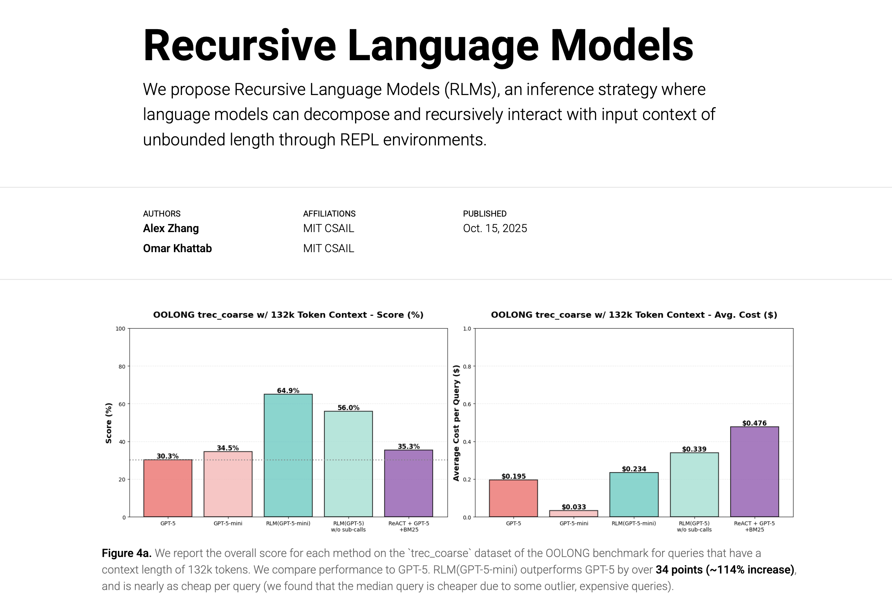

# Recursive Language Models (minimal version) 

[Link to the official RLM codebase](https://github.com/alexzhang13/rlm)

[Link to the paper](https://arxiv.org/abs/2512.24601v1)

[Link to the original blogpost 📝](https://alexzhang13.github.io/blog/2025/rlm/)

I received a lot of requests to put out a notebook or gist version of the codebase I've been using. Sadly it's a bit entangled with a bunch of random state, cost, and code execution tracking logic that I want to clean up while I run other experiments. In the meantime, I've re-written a simpler version of what I'm using so people can get started building on top and writing their own RLM implementations. Happy hacking!



I've provided a basic, minimal implementation of a recursive language model (RLM) with a REPL environment for OpenAI clients. This implementation now supports **multi-depth recursion** - sub-LLMs can have their own REPL environments and spawn further sub-LLMs!

In this stripped implementation, we exclude a lot of the logging, cost tracking, prompting, and REPL execution details of the experiments run in the blogpost. It's relatively easy to modify and build on top of this code to reproduce those results, but it's currently harder to go from my full codebase to supporting any new functionality.

## ⚡ NEW: Async Batch Processing

This implementation now supports **parallel batch processing** for sub-LLM calls! When the RLM needs to process multiple chunks or queries, it can now do so in parallel instead of sequentially, providing significant speedups.

**Key Features:**
- `llm_batch(prompts: List[str]) -> List[str]` function available in REPL environment
- Automatic parallel execution using `asyncio`
- Configurable concurrency limits for rate limiting
- Fully backward compatible with existing code

**Performance Example:**
```python
# Sequential (OLD) - ~6 seconds for 3 calls
for chunk in chunks:
    result = llm_query(f"Analyze: {chunk}")

# Parallel (NEW) - ~2 seconds for 3 calls
prompts = [f"Analyze: {chunk}" for chunk in chunks]
results = llm_batch(prompts)  # 3x faster!
```

See [ASYNC_BATCH_GUIDE.md](docs/ASYNC_BATCH_GUIDE.md) for detailed documentation and examples.

## 🔄 NEW: Multi-Depth Recursion

This implementation now supports **multi-depth recursion** where sub-LLMs can have their own REPL environments and spawn further sub-LLMs!

**Depth Hierarchy (with max_depth=3):**
```
Root (depth=0)     → Has REPL, calls llm_query()/llm_batch()
  └── Sub (depth=1)   → Has REPL, calls llm_query()/llm_batch()
        └── Sub (depth=2)   → Has REPL, calls terminal Sub_RLM
              └── Terminal      → Direct API call, no REPL
```

**Usage:**
```python
from rlm.rlm_repl import RLM_REPL

# Create RLM with multi-depth recursion
rlm = RLM_REPL(
    model="gpt-4o-mini",
    recursive_model="gpt-4o-mini",
    max_depth=2,        # Enable 2 levels of recursion (default: 1)
    max_iterations=5,
    enable_logging=True,
)

result = rlm.completion(context=context, query=query)
```

**Key Parameters:**
- `max_depth=1` (default): Original behavior, sub-LLMs are terminal (no REPL)
- `max_depth=2`: Sub-LLMs have their own REPL, can delegate tasks with code
- `max_depth=3+`: Deeper recursion for complex hierarchical analysis

**When to Use Higher Depths:**
- Complex multi-step analysis where sub-tasks need code execution
- Hierarchical document processing
- Divide-and-conquer algorithms on text
- When sub-LLMs need to call their own sub-LLMs

See `extra/example_multi_depth.py` for working examples.

## Basic Example
We have all the basic dependencies in `requirements.txt`, although none are really necessary if you change your implementation (`openai` for LM API calls, `python-dotenv` for .env loading, and `rich` for logging).

In `main.py`, we have a basic needle-in-the-haystack (NIAH) example that embeds a random number inside ~1M lines of random words, and asks the model to go find it. It's a silly Hello World type example to emphasize that `RLM.completion()` calls are meant to replace `LM.completion()` calls.

To see the new batch processing in action, run:
```bash
python extra/example_batch.py
```

## Code Structure
In the `rlm/` folder, the two main files are `rlm_repl.py` and `repl.py`. 
* `rlm_repl.py` offers a basic implementation of an RLM using a REPL environment in the `RLM_REPL` class. The `completion()` function gets called when we query an RLM. Now supports `max_depth` parameter for multi-depth recursion.
* `repl.py` is a simple `exec`-based implementation of a REPL environment that adds an LM sub-call function. The `REPLEnv` class now conditionally creates either `RLM_REPL` (recursive) or `Sub_RLM` (terminal) based on the current depth.

The functionality for parsing and handling base LLM clients are all in `rlm/utils/`. We also add example prompts here.

> The `rlm/logger/` folder mainly contains optional logging utilities used by the RLM REPL implementation. If you want to enable colorful or enhanced logging outputs, you may need to install the [`rich`](https://github.com/Textualize/rich) library as a dependency.
```
pip install rich
```

When you run your code, you'll see something like this:


